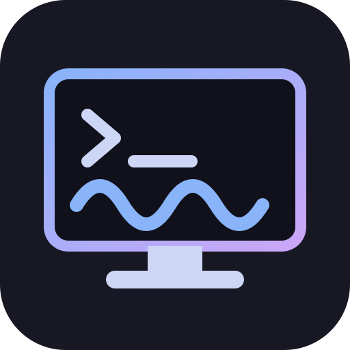

<div align="center">



# Termland

**A Wayland remote desktop server that actually works.**

[](https://github.com/jboero/termland/releases/latest)
[](https://copr.fedorainfracloud.org/coprs/boeroboy/mawenzy/package/termland-server/)
[](LICENSE)
[](Cargo.toml)
[](#why-this-exists)
[](docs/mobile-clients.md)
[](AGENTS.md)

</div>

Termland streams full interactive desktop and application sessions over the network using AV1 video, Opus audio, and modern transport security. It exists because Wayland broke remote desktop workflows and nobody fixed them.

[Screencast_20260416_143042.webm](https://github.com/user-attachments/assets/a47450a8-c8ec-4422-8ead-6d65bad59c72)

**There's also a native Android app.** No server changes, no second protocol —
it's the exact same client, just Kotlin/Compose on top of the shared Rust
core. Sideload it on an Android tablet with a Bluetooth keyboard/mouse and
you've got a full remote desktop terminal; sideload it on an Android TV box
and the TV becomes one too. Grab a build from the
[releases page](https://github.com/jboero/termland/releases/latest) — see
[Android Client](#android-client) below — or read on for the full picture.


## Why This Exists

For over two decades, X11 gave Linux a simple, reliable remote desktop story. X forwarding, NX/X2Go, and FreeNX let you run graphical sessions on remote servers as easily as SSH. Entire organizations built terminal server infrastructure on this — thin clients, shared workstations, remote development environments.

Then Wayland happened.

Wayland's architecture deliberately removed the network transparency that made all of this possible. The display protocol became local-only by design. X forwarding? Gone. NX protocol? Dead. X2Go? Broken on any modern desktop that defaults to Wayland.

The replacements are inadequate:
- **xrdp** only works through X11 compatibility layers, defeating the purpose
- **GNOME Remote Desktop** is GNOME-only, limited, and requires PipeWire plumbing
- **KDE's Krfb/Krdc** lost most functionality in the Wayland transition
- **VNC-over-Wayland** solutions are slow, lack proper input handling, and don't support audio
- **Chrome Remote Desktop** requires a Google account and only works with Chrome

If you run any modern Linux desktop on Wayland — KDE Plasma, GNOME, sway, Hyprland, or anything else — your remote desktop options range from limited to nonexistent. KDE is hit hardest (Krfb/Krdc essentially stopped working), but the gap affects every Wayland compositor.

**Termland fills this gap.** It works with any Wayland-compatible desktop environment or application.

## What It Does

Each session runs an isolated headless Wayland compositor with its own screen capture, input injection, and audio sink. The video stream is AV1-encoded with hardware acceleration when available, and audio is forwarded via Opus. The whole thing runs over SSH or direct TCP with TLS.

```
  Client (laptop/thin client)              Server (workstation/server)
  +----------------------------+           +----------------------------------+
  |  termland-client           |           |  termland-server                 |
  |  - AV1 decode (HW/SW)     |  SSH or   |  - Headless Wayland compositor   |
  |  - Opus audio playback     |<--------->|  - AV1 encode (HW/SW)           |
  |  - Keyboard/mouse capture  |  TCP+TLS  |  - Opus audio capture            |
  |  - Live window resize      |           |  - PAM authentication            |
  +----------------------------+           +----------------------------------+
                                                        |
                                                  Wayland apps
                                              (Plasma, Firefox, etc.)
```

## Features

### Video
- **AV1 encoding** with automatic hardware detection:
  Intel QSV, NVIDIA NVENC, AMD AMF, AMD VA-API, SVT-AV1 software fallback
- **AV1 decoding** with automatic fallback:
  Intel QSV, NVIDIA CUVID, dav1d software
- **Adaptive quality**: configurable bitrate, CRF, encoder preset
- **Live resize**: drag the client window and the remote compositor resizes to match
- Typical data rate: **~2 KB/s** for a still 4K desktop, scaling with motion

### Audio
- **Opus codec** at 48kHz stereo, 32kbps with DTX and FEC
- Per-session PulseAudio null sink (session-isolated audio)
- Silence detection skips encoding when nothing is playing

### Transport
- **SSH subsystem** (recommended): zero-config, piggybacks on existing sshd.
  Uses your SSH keys, LDAP, Kerberos, 2FA — whatever sshd is configured for.
  Install the RPM, restart sshd, done.
- **Direct TCP with TLS**: auto-generated self-signed certs or bring your own.
  PAM authentication for any backend your system supports.

### Session Modes
- **Desktop**: full multi-window session via labwc (Plasma, GNOME, sway, etc.)
- **App**: single fullscreen application via cage (kiosk mode)

### Client
- Client-side cursor rendering for low-latency mouse interaction
- Data rate overlay, fullscreen toggle (F11), menubar toggle (F10)
- Shell tab completion for bash, zsh, fish
- Desktop session manager (`--manager`): saved multi-host connection
  profiles, live per-host session list, resume/new/close
- Seamless reconnect: auto-retry with backoff, reattaches to the same
  session after an unexpected drop instead of exiting

### Mobile (Android)
A native Android client — same protocol, same server, no separate backend.
Turns any Android tablet, or an Android TV box, into a remote desktop
terminal. Works as a **full thin client with an external keyboard and mouse**
(the primary use case: pair a Bluetooth keyboard/mouse, or a USB-C dock on a
tablet, and it's a real desktop terminal) **or standalone with just the
touchscreen**, no peripherals required:

- **With a keyboard/mouse** (Bluetooth or USB-C dock): real hardware input —
  `Ctrl+C`, `Alt+Tab`, `Ctrl+Alt+F2` and friends all reach the remote
  session, plus mouse hover/click/scroll and an optional pointer-capture
  trackpad mode.
- **Touch-only**: tap = click, long-press = right-click, drag = drag,
  two-finger scroll = wheel, plus an on-screen modifier bar (Ctrl/Alt/Super/
  Esc/Tab/arrows) for the shortcuts a touchscreen alone can't express. The
  soft keyboard commits real Unicode (autocorrect, emoji, CJK) via a
  dedicated text-input channel — not synthesized scancodes.
- Hardware-accelerated decode via Android's own `MediaCodec` (no bundled
  FFmpeg), codec choice negotiated automatically from what the device
  actually supports.
- Opus audio playback, and the same persistent-session resume list as the
  desktop client — pick up a dropped mobile connection exactly where it
  left off.
- Transports: TCP+TLS, embedded SSH (pure-Rust, no `ssh` binary needed —
  works inside Android's app sandbox), and QUIC (connection migration
  across Wi-Fi↔cellular, split video/audio planes so a lossy link doesn't
  stall input).

## Quick Start

### SSH Mode (Recommended)

On the server, install the RPM (or copy the binary) and restart sshd:

```bash
# The RPM installs an sshd drop-in automatically:
#   /etc/ssh/sshd_config.d/50-termland.conf
sudo systemctl restart sshd
```

On the client:

```bash
termland-client --ssh user@server
```

That's it. SSH handles authentication and encryption.

### Direct TCP Mode

On the server:

```bash
# With TLS + PAM auth (recommended for non-SSH deployments)
termland-server --tls --auth --bind 0.0.0.0

# Or plaintext on localhost (behind SSH tunnel)
termland-server
```

On the client:

```bash
# TLS with self-signed cert
termland-client --tls --accept-invalid-certs server:7867

# With authentication
termland-client --tls --accept-invalid-certs --user john --password xxx server:7867

# Plaintext (localhost/tunnel only)
termland-client localhost:7867
```

### Options

```
# Video quality (1-100, default 75)
termland-client -q 50 --ssh user@server

# Enable audio
termland-client --audio --ssh user@server

# App mode (single app, kiosk)
termland-client --mode app:firefox --ssh user@server

# Custom desktop shell
termland-client --desktop-shell "dbus-run-session sway" --ssh user@server

# Encoder tuning (SVT-AV1)
termland-client --preset 8 --crf 30 --ssh user@server
```

### Android Client

No server-side changes needed — the Android app speaks the same protocol as
`termland-client`. Grab an APK from the
[releases page](https://github.com/jboero/termland/releases/latest) and
sideload it — on a tablet, an Android TV box, or an emulator, it's the same
APK either way:

- `termland-android-vX.Y.Z-debug.apk` — debug-signed, installs directly:
  `adb install termland-android-vX.Y.Z-debug.apk`, or transfer the file to
  the device and install it from there (enable "install unknown apps" for
  whatever file manager/browser you use to open it).
- `termland-android-vX.Y.Z-release-unsigned.apk` — the optimized/minified
  release build, but **unsigned**: sign it with your own key before
  installing (`apksigner sign --ks your.keystore ...`), or just use the
  debug build above if you don't need a release-signed artifact.

Or build it yourself:

```bash
cd android
./gradlew assembleDebug
# APK at app/build/outputs/apk/debug/app-debug.apk
```

Building requires the Android SDK/NDK (`ANDROID_HOME`/`ANDROID_NDK_HOME`) and
a Rust toolchain with the Android targets installed
(`rustup target add aarch64-linux-android x86_64-linux-android`) — Gradle
cross-compiles `termland-mobile-core` and generates its Kotlin bindings
automatically as part of the build, no manual steps.

On first launch, open the profile screen and add a host (same connection
details as `termland-client`: address, TLS/SSH/QUIC, credentials). Sessions
you create or resume there show up in the same resumable-session list the
desktop `--manager`/`--tray` see, since they're the same server-side
sessions.

## Building from Source

### Dependencies

Fedora/RHEL:
```bash
sudo dnf install rust cargo ffmpeg-free-devel opus-devel pulseaudio-libs-devel \
    pam-devel wayland-devel wayland-protocols-devel alsa-lib-devel \
    libxkbcommon-devel libX11-devel cmake gcc gcc-c++
```

### Build

```bash
cargo build --release
# Binaries in target/release/termland-server and target/release/termland-client
```

### RPM Packages

```bash
# Create source tarball
cd /path/to/parent
tar czf ~/rpmbuild/SOURCES/termland-0.3.0.tar.gz \
    --transform='s,^termland,termland-0.3.0,' termland/

# Build RPMs
rpmbuild -ba termland/packaging/termland-server.spec
rpmbuild -ba termland/packaging/termland-client.spec
```

## Architecture

```
termland/
  crates/
    termland-protocol/    Wire protocol, CBOR serialization, framing
    termland-compositor/  Headless Wayland compositor (labwc/cage), screencopy, input
    termland-codec/       AV1 encode/decode, Opus encode/decode
    termland-server/      Session broker, PAM auth, TLS, capture + encode pipeline
    termland-client/      winit window, softbuffer renderer, decode + playback
    termland-mobile-core/ UniFFI Rust core for mobile (protocol + transport +
                           negotiation; no FFmpeg — decode is platform-native)
  android/                Kotlin/Compose app built on termland-mobile-core
```

**Wire protocol**: length-delimited binary framing (`[Magic "TL"][MsgID][Length][CBOR]`) carrying control messages (handshake, auth, session lifecycle, resize, ping) and data messages (AV1 video, Opus audio, cursor image, clipboard, key/pointer input, Unicode text input). Runs over TCP, TLS, an embedded SSH subsystem channel (`russh` on mobile, since app sandboxes forbid spawning the `ssh` binary), or QUIC — Q1 (single-stream drop-in) plus Q2 (video and audio split onto their own QUIC stream/datagrams so a lossy link doesn't stall control/input).

**Encoder pipeline**: compositor buffer capture via wlr-screencopy-unstable-v1, RGBA-to-YUV conversion respecting ffmpeg's 32-byte row alignment, hardware encoder probing at startup with automatic fallback.

**Decoder pipeline**: hardware decoder probing with confirmation-before-trust (first successful decode confirms the backend), automatic reinit on dimension change (handles CUVID's SPS binding), automatic fallback to next backend on failure.

## Packaging

### COPR (Fedora/RHEL/CentOS/EPEL)

Pre-built RPMs, rebuilt from each tagged release:

```bash
sudo dnf copr enable boeroboy/mawenzy
sudo dnf install termland-server termland-client
```

`termland-server`/`termland-client` are two packages inside the
[boeroboy/mawenzy](https://copr.fedorainfracloud.org/coprs/boeroboy/mawenzy/)
COPR project (a general personal repo, not termland-only — the `dnf copr
enable` step above only pulls in what you actually `dnf install`). Built
directly from `packaging/termland-server.spec` / `packaging/termland-client.spec`
in this repo, so it tracks whatever's tagged here.

The server RPM installs:
- `/usr/bin/termland-server`
- `/etc/ssh/sshd_config.d/50-termland.conf` — SSH subsystem registration
- `/usr/lib/systemd/system/termland-server.service` — systemd unit
- `/etc/sysconfig/termland-server` — documented environment config
- `/etc/pam.d/termland` — PAM service for auth
- Shell completions for bash, zsh, fish

The client RPM installs:
- `/usr/bin/termland-client`
- Shell completions for bash, zsh, fish

## Roadmap

- [x] Clipboard sync (plain text, bidirectional)
- [x] Cursor shape sync (real cursor bitmap, not a placeholder)
- [x] QUIC transport (Q1: drop-in single-stream; Q2: video/audio split onto
      their own stream/datagrams, HOL-free from control/input; Q3 —
      datagram-fragmented video with FEC — not started)
- [x] Native Android client (termland-mobile-core + Kotlin/Compose app;
      see [docs/mobile-clients.md](docs/mobile-clients.md))
- [x] Embedded SSH transport (`russh`) for the mobile client
- [x] Desktop session manager (`termland-client --manager`, egui): saved
      multi-host profiles, per-host session list, resume/new/close (not
      Qt6/cxx-qt — see [ROADMAP.md](ROADMAP.md) for why)
- [x] Session isolation: `setuid` into the PAM-authenticated user, with
      ownership enforcement on session list/attach/close
- [x] Clipboard file transfer (copy files, real files land on the other side)
- [x] Seamless reconnect (auto-retry + reattach on an unexpected drop)
- [x] Android audio playback (MediaCodec Opus → AudioTrack)
- [ ] iOS client
- [ ] Audio bitrate configuration
- [ ] Multi-monitor support
- [ ] Web client (WebCodecs + WebTransport)

See [ROADMAP.md](ROADMAP.md) for the full detail behind each item.

## License

**LGPL-3.0-or-later** — see [LICENSE](LICENSE) for the full text.

In short: you can use, modify and redistribute Termland, including inside
proprietary products, provided changes *to Termland itself* are published
under the same licence and users can replace the Termland components. Linking
against it does not make your own code LGPL. This is the standard copyleft
arrangement for a library-and-tools project, chosen so downstream distributions
and desktop environments can adopt it without friction.

Termland bundles no third-party code in-tree; dependencies keep their own
licences, resolved by Cargo (`cargo tree` / `Cargo.lock` for the current set).

## AI assistance

Termland is written with AI assistance, primarily Anthropic's Claude, directed
by the maintainer. Attribution is recorded per commit as `Co-Authored-By`
trailers rather than left to be inferred.

[AGENTS.md](AGENTS.md) documents how that works, what is and is not reproducible
about it, and why the code should be reviewed on its merits like any other
contribution — being AI-assisted is not a claim of correctness. Raised
originally in [#7](https://github.com/jboero/termland/issues/7).
